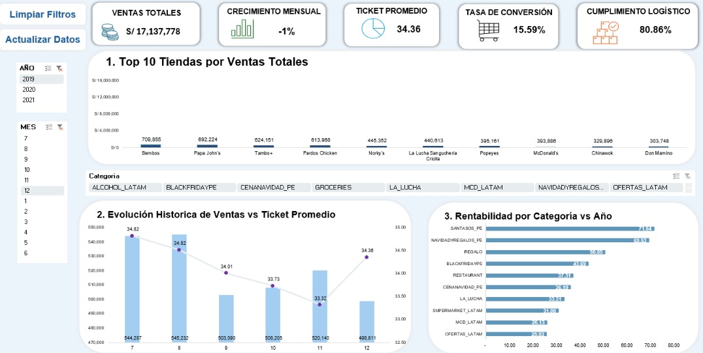

# 📊 Análisis Comercial y Operativo de Delivery (Excel End-to-End)

[🔗 **Haz clic aquí para interactuar con el Dashboard en vivo en OneDrive**](https://1drv.ms/x/c/b6a5de71cf2b297c/IQCXrNfmjVFeQ5fX6k5fn8Z_ARnFSydafAml7sSq4yXch6o)

El objetivo de este proyecto es evaluar el rendimiento comercial, la rentabilidad transaccional y la eficiencia operativa de una aplicación de delivery. Integrando datos de tráfico, transacciones y puntos de venta, se diseñó un modelo relacional para proponer estrategias de optimización basadas en datos.

## 🛠️ Arquitectura y Procesamiento de Datos

* **ETL con Power Query:** Limpieza, normalización y consolidación de las tablas `Datos_tiendas`, `Funnel_tiendas` y `Pedidos_tiendas`.
* **Modelado Relacional (Power Pivot):** Diseño del modelo de datos y desarrollo de medidas DAX para KPIs dinámicos.
* **Automatización (VBA):** Implementación de macros para agilizar la actualización del reporte y limpieza de filtros.

## 📈 Vista del Dashboard

## 🔍 Hallazgos Clave del Negocio

* **El Valor Oculto del Segmento Local:** Aunque las grandes cadenas (`big_chain`) lideran el volumen masivo, los negocios locales (`local_hero`) igualan la eficiencia de conversión (**16%**) con un menor tráfico (10.8M de visitas). Estratégicamente, traccionan un **Ticket Promedio superior (S/ 43.07 vs S/ 36.88)**, siendo un segmento altamente rentable.
* **Sensibilidad de la Rentabilidad (AOV):** La ganancia de la plataforma es altamente sensible al Ticket Promedio. En periodos críticos (ej. Nov 2019), el AOV cayó a S/ 33.32. Al ser el costo logístico un gasto fijo, esta proliferación de pedidos pequeños canibaliza el margen de contribución.
* **Fuga Crítica en el Embudo de Conversión:** De 5.4 millones de usuarios históricos que armaron un carrito, la **Tasa de Abandono se sitúa en un 50% exacto**. Perder a la mitad de los compradores potenciales en la etapa de *checkout* representa una fuga de capital masiva.
* **Impacto de las Fricciones Logísticas:** La auditoría operativa (2019) revela que el **19% de los pedidos se entregan fuera de plazo** (>45 min). Al segmentar, los pedidos sin clasificación (zonas en blanco) disparan las demoras a un **27%**, destruyendo la experiencia del usuario y la frecuencia de compra.

## 💡 Recomendaciones Estratégicas

1. **Blindar el Margen (AOV):** Configurar el algoritmo para sugerir productos adicionales (*cross-selling*) antes del pago, forzando un "Ticket Mínimo Dinámico" que asegure que el margen bruto de cada viaje absorba el costo logístico de última milla.
2. **Recuperación de Ventas (Remarketing):** Desplegar campañas automatizadas dirigidas al segmento del 50% que abandonó el carrito. A la par, es imperativo simplificar la interfaz (UI/UX) del *checkout* para reducir la fricción transaccional.
3. **Optimización de Flota en Zonas Críticas:** Reasignar presupuesto hacia subsidios operativos para garantizar mayor disponibilidad de motorizados en zonas de alta demora. Financieramente, elevar la Tasa de Entregas a Tiempo a un estándar **>90%** es más viable que asumir el Costo de Adquisición de Clientes (CAC) por pérdida de usuarios.
